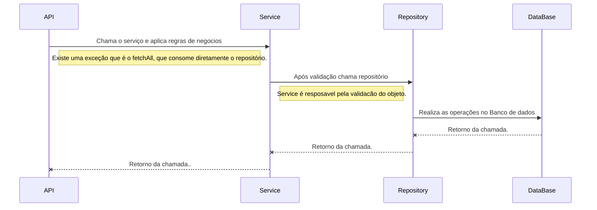

# BankSlip
> O projeto um API Rest para geração de boletos que será consumido por um módulo de um sistema de gestão financeira de microempresas. A API  fornece os seguintest serviços:
>* Criar boleto
>* Listar boletos
>* Ver detalhes
>* Pagar um boleto
>* Cancelar um boleto
>
>A arquitetura do projeto foi desenvolvida utilizando springboot como framework base. Lombok foi outro framework utilizado para diminuir a verbosidade das classes.


# Pré-requisitos

Para desenvolver:
-   JDK8 +
-   Eclipse
-   Lombok instalado no Eclipse
-   Postman

Para implantar a API:
-   JDK8 +
-   Git
-   Maven

## Instalação da API

-   mkdir Bankslip
-   git clone  [https://github.com/igorhmendes/bankslips.git](https://github.com/igorhmendes/bankslips.git)  Bankslip
-   cd Bankslip/Bankslip-rest
-   mvnw.cmd clean install
-   java -jar target/bankslips-rest-0.0.1-SNAPSHOT.jar

## Diagrama de fluxo

Diagrama de fluxo da aplicação bankslip e suas camadas:




## Exemplo de uso

A Api pode ser consumida usando o Postman. Para inserir um novo BankSlip faça um ****POST**** para o seguinte endpoint:
```sh
http://localhost:8080/rest/bankslips
```
E utilize esse Json como exemplo:
```sh
{
"due_date":"2018-04-20",
"total_in_cents":"100000",
"customer":"Trillian Company",
"status":"PENDING"
}
```

## Configuração para Desenvolvimento

### Pre requisitos

1.  Instalar JDK8 Link:
  [http://www.oracle.com/technetwork/pt/java/javase/downloads/jdk8-downloads-2133151.html](http://www.oracle.com/technetwork/pt/java/javase/downloads/jdk8-downloads-2133151.html)
    
2.  Instalar Eclipse Link:  [https://www.eclipse.org/downloads/packages/eclipse-ide-java-developers/oxygen3a](https://www.eclipse.org/downloads/packages/eclipse-ide-java-developers/oxygen3a) 

4.  Instalar Lombok Link: [https://projectlombok.org/download](https://projectlombok.org/download). Execute o .jar com o eclipse fechado.

5.  Instalar Git Link:  [https://git-scm.com/downloads](https://git-scm.com/downloads)
    
6.  Instalar Maven Link:  [https://maven.apache.org/download.cgi](https://maven.apache.org/download.cgi)  Descompacte o arquivo e crie uma variável de ambiente do sistema operacional.
    
7.  Postman Link:  [https://www.getpostman.com/apps](https://www.getpostman.com/apps)

## Histórico de lançamentos

0.0.1-SNAPSHOT

-   Starting project.
-   Improving structure, it was added database connection, profiles and development stuffs.
-   It was added structure to handle exceptions and to validate data
-   It was implemented repository, service, rest and integrated tests.
-   It was improve code and it implemented junits tests.

## Meta

Igor Mendes – igorhmendes@gmail.com
